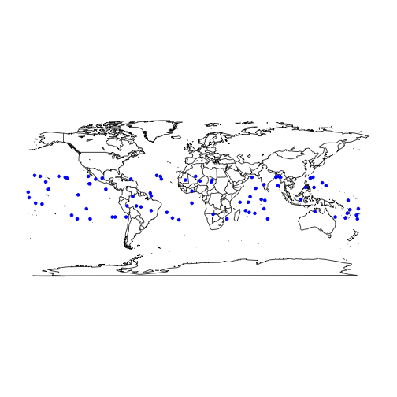

## Lunar Eclipses


A lunar eclipse occurs when the Moon passes directly behind the Earth into its umbra (shadow). This can occur only when the Sun, Earth, and Moon are aligned (in "syzygy") exactly, or very closely so, with the Earth in the middle. Hence, a lunar eclipse can only occur the night of a full moon. 


There are 3 types of lunar eclipses: A penumbral eclipse occurs when the Moon passes through the Earth's penumbra. A partial lunar eclipse occurs when only a portion of the Moon enters the umbra. 
A total eclipse occurs when the Moon travels completely into the Earth's umbra.

For further information please see:
https://en.wikipedia.org/wiki/Lunar_eclipse


--- .class #id 


## Why build an app to forecast lunar eclipes?

A key contribution of data science is to be able to display large data sets in an intuitive visual way. On the NASA website, there is an extensive catalog of accurate information in a raw data format.
The problem, however, is that this information can not be easily comprehended by humans.

There is considerable research on how eclipses affect tides, plants, animals, weather and other areas of nature. However, this research is in it's early stages. Wouldn't it be nice to avoid an area at a certain time if there is a chance it may affect you in a negative way?

Please try out the app  https://vanilla-ic.shinyapps.io/DevDataProdProject


--- .class #id 

## A sample display of just the Total Lunar Eclipses from years 1901 to 2000.


```r
map("world")
points(data$long,data$lat,pch=20,col="blue")
```

 


--- &radio

## Slide 5
## Review


How many types of Lunar Eclipses are there?

1. 1
2. 2
3. _3_
4. 4

*** .hint 
It's not 1, 2, or 4
*** .explanation 
There are three types: Total, Partial, and Penumbral.


